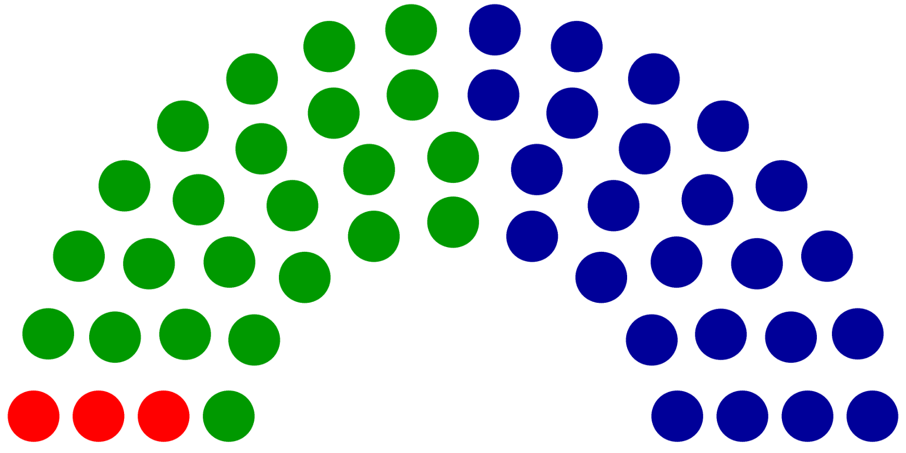

# renpy-ParliamentDiagram
A tool based upon https://github.com/slashme/parliamentdiagram, to create
parliament diagrams showing the distribution of seats among the forces in
presence, also called "election apportionment diagrams" on Wikimedia.
This creates renpy Displayables to show such diagrams in renpy.

## Howto
There are two styles of diagrams, Newarch ones are like an hemicycle, while
the Westminster ones arrange seats in rows like in the british or australian
parliaments.

### Newarch
`newarch(the_list, bg=None, **kwargs)`

- `the_list` takes a list containing a sublist for each party having seats.
Each sublist must contain (in that order) a number of seats and a color. Other
elements in that sublist will be ignored.

- `bg` can take a color, which will fill the background of the chart.

Other keyword arguments will be passed to the Displayable constructor.

**Warning ! Be careful to use the newarch function and not directly the Newarch
displayable.**

As this displays circles, some measure of anti-aliasing is necessary to render
it as smooth as it deserves. That's why the Newarch displayable is rendered
bigger than required, and then zoomed down to fit the requested size. The
anti-aliasing factor can be found as the `aafactor` attribute of the `Newarch`
class. 1 will do nothing, 2 will render it twice as wide and high as it finally
needs.

Example : `newarch([(3, '#f00'), (23, '#090'), (24, '#009')])`

